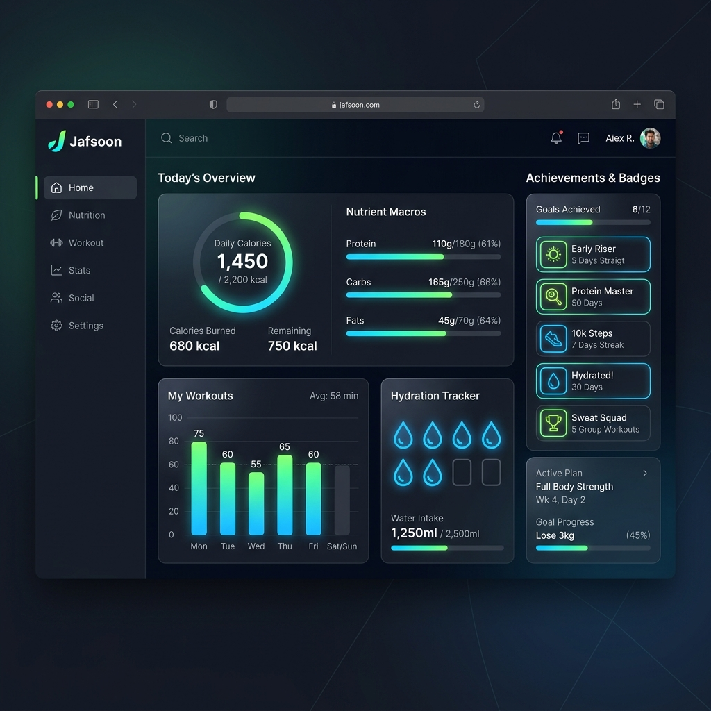

<div align="center">
  
  <br />
  <br />
  <h1>Jafsoon</h1>
  <p><strong>Your Ultimate Personalized Dieting and Nutrition Platform</strong></p>
</div>

<br />

## 🥗 Overview

**Jafsoon** is a modern, comprehensive dieting, fitness, and health tracking application designed to help users achieve their wellness goals. Featuring personalized meal plans, detailed macro tracking, interactive fitness logging, gamified achievements, and a localized user interface, Jafsoon makes healthy living accessible, intuitive, and engaging.

Whether your goal is weight loss, muscle gain, or simply maintaining a balanced and healthy lifestyle, Jafsoon provides the precise tools and data-driven insights you need to succeed.

---

## ✨ Key Features

- **📊 Comprehensive Nutrition & Macro Tracking:** Log meals effortlessly and monitor your daily caloric, protein, carbohydrate, and fat intake with interactive, responsive visual charts.
- **💧 Smart Hydration Tracker:** Stay on top of your water intake with an interactive logger. Track progress against custom target targets with glass-by-glass interactive state updates.
- **🏋️‍♂️ Activity & Workout Log:** Track physical activities, duration, and calories burned to offset your net caloric intake dynamically.
- **🏆 Gamified Achievements & Badges:** Stay motivated with an automated trophy system! Unlock achievements (like *Water Master*, *Calorie Pioneer*, or *Activity Champion*) as you hit your daily goals.
- **🥑 Meal Plans & Recipe Library:** Browse tailored, fitness-oriented recipes (Protein-Rich, Low-Carb, Vegan) with prep times and ingredients, and log them directly to your diary with a single click.
- **🧮 Interactive BMI & TDEE Calculators:** Calculate your Body Mass Index and estimate your Total Daily Energy Expenditure to determine recommended target macro structures.
- **💬 Jafsoon Feed (Community Space):** Share your fitness progress, recipes, and motivational updates with a built-in community feed.
- **🌐 Localization (Multi-language):** Seamless translation and UI toggling between **English (EN)** and **German (DE)** supported globally throughout the application.
- **🔒 Secure Authentication:** Private and secure user profiles to keep your health data protected, utilizing JWT-based tokens.

---

## 🛠️ Technology Stack

Jafsoon is engineered using a modern, scalable full-stack ecosystem:

### Frontend
- **Framework:** [React 19](https://react.dev/) powered by [Vite](https://vite.dev/) for high-performance HMR and optimized builds.
- **Routing:** [React Router DOM 7](https://reactrouter.com/) for page navigation.
- **Localization:** [i18next](https://www.i18next.com/) & [react-i18next](https://react.i18next.com/) for translation management.
- **Styling:** Custom Vanilla CSS with custom CSS variables to ensure a sleek, responsive design system.

### Backend
- **Runtime Environment:** [Node.js](https://nodejs.org/)
- **Framework:** [Express.js](https://expressjs.com/) for API routing.
- **Database:** [MongoDB](https://www.mongodb.com/) using [Mongoose ODM](https://mongoosejs.com/) for schema modeling.
- **Authentication:** JWT-based user session handling with `bcryptjs` encryption.

---

## 📂 Project Structure

The project follows a clean repository layout separating client and server components:

```
├── backend/                  # Node.js/Express Server
│   ├── src/
│   │   ├── config/           # Database connections (db.js)
│   │   ├── controllers/      # Route controllers and business logic
│   │   ├── models/           # Mongoose schemas (User, etc.)
│   │   ├── routes/           # Express routes and endpoints
│   │   └── app.js            # App middleware and setup
│   ├── server.js             # Main server execution script
│   └── package.json          # Backend dependencies
│
├── frontend/                 # React SPA Client
│   ├── src/
│   │   ├── components/       # Reusable UI widgets (Navbar, Footer, Calculators, etc.)
│   │   ├── locales/          # Localization resources (en.json, de.json)
│   │   ├── pages/            # View pages (Dashboard, Home, Plans, About, etc.)
│   │   ├── styles/           # Component stylesheet modules
│   │   ├── App.jsx           # Root layout and routes
│   │   └── main.jsx          # Vite entrypoint
│   └── package.json          # Frontend dependencies
```

---

## 🚀 Getting Started

Follow these instructions to set up the project locally for development and testing.

### Prerequisites

Ensure you have the following installed on your local machine:
- **Node.js** (v18.0.0 or higher recommended)
- **npm** (v9.0.0 or higher)
- **Git**

### Installation & Setup

1. **Clone the repository:**
   ```bash
   git clone https://github.com/Jafsoon1000/Jafsoon-Deiting.git
   cd Jafsoon-Deiting
   ```

2. **Install backend dependencies:**
   ```bash
   cd backend
   npm install
   ```

3. **Install frontend dependencies:**
   ```bash
   cd ../frontend
   npm install
   ```

4. **Environment Variables:**
   Create a `.env` file in the `backend` directory and configure your credentials:
   ```env
   PORT=3000
   MONGODB_URI=your_mongodb_connection_string
   JWT_SECRET=your_jwt_secret
   ```

### Running the Development Servers

You will need two terminal windows to run both services simultaneously.

**Terminal 1 (Backend Server):**
```bash
cd backend
npm run dev
```

**Terminal 2 (Frontend Client):**
```bash
cd frontend
npm run dev
```
The application will be accessible locally at `http://localhost:5173`.

---

## 🌐 Localization (i18n)

Localization configurations are structured in `frontend/src/locales/`. 
- **English Translations:** Found in [`frontend/src/locales/en.json`](./frontend/src/locales/en.json).
- **German Translations:** Found in [`frontend/src/locales/de.json`](./frontend/src/locales/de.json).

To add a new translation string, ensure you update both locale files with matching JSON keys.

---

## 📡 API Endpoints

The primary API routes available on the backend server include:

- `POST /api/auth/signup` - Register a new user (Body: `name`, `email`, `password`)
- `POST /api/auth/signin` - Authenticate an existing user (Body: `email`, `password`)
- `GET /api/health` - Health check status report for verification

---

## 🤝 Contributing

We welcome contributions to make Jafsoon even better! If you'd like to help:

1. Fork the repository.
2. Create your feature branch (`git checkout -b feature/AmazingFeature`).
3. Commit your changes (`git commit -m 'Add some AmazingFeature'`).
4. Push to the branch (`git push origin feature/AmazingFeature`).
5. Open a Pull Request.

Please ensure your code adheres to the existing styling guidelines and lint rules.

---

## 🔒 Copyright & License

This project is proprietary and confidential. All rights reserved. Unauthorized copying, distribution, or modifications of this codebase via any medium is strictly prohibited.

---
<div align="center">
  <sub>Built with ❤️ by Jafsoon.</sub>
</div>
