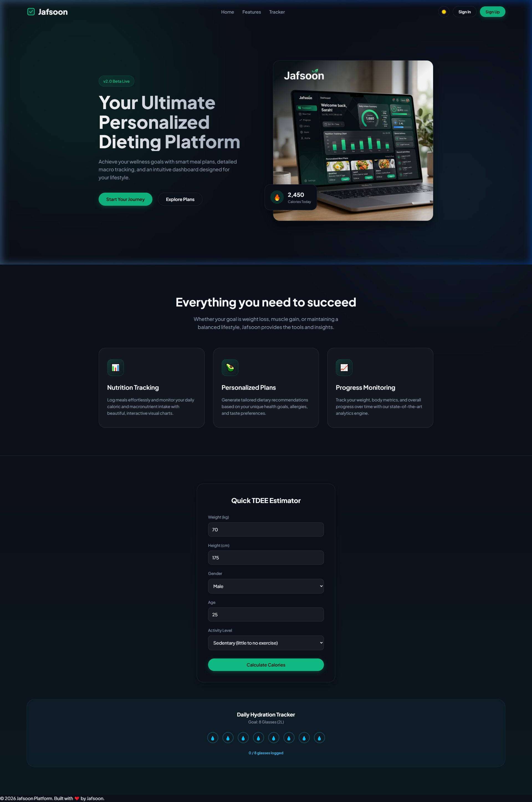
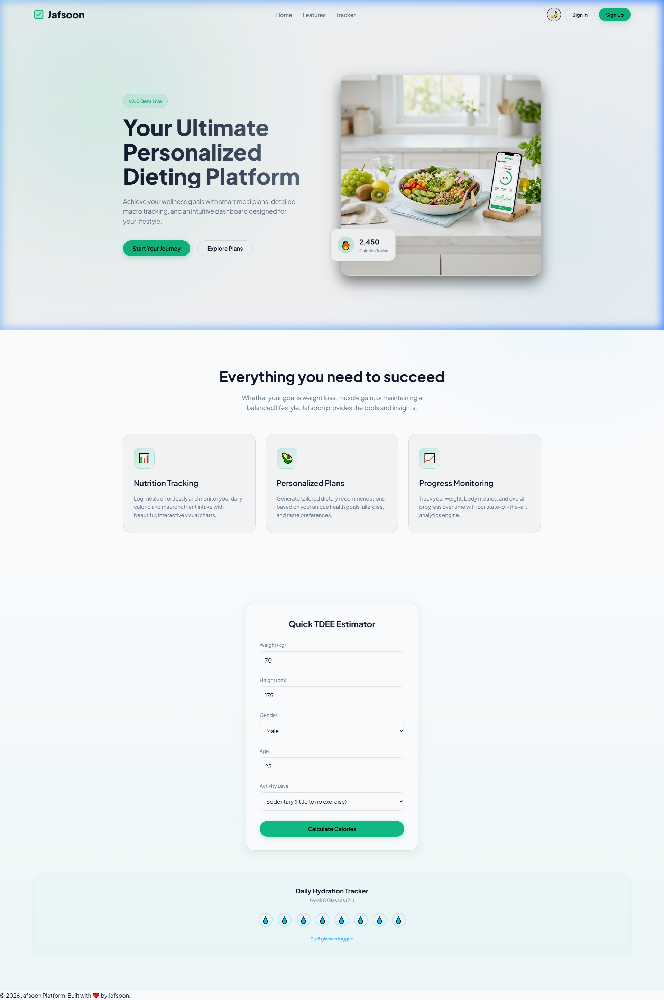

<div align="center">
  <table>
    <tr>
      <td></td>
      <td></td>
    </tr>
    <tr>
      <td align="center"><b>Dark Mode</b></td>
      <td align="center"><b>Light Mode</b></td>
    </tr>
  </table>
  <br />
  <br />
  <h1>Jafsoon</h1>
  <p><strong>Your Ultimate Personalized Dieting and Nutrition Platform</strong></p>
  
  [](https://opensource.org/licenses/MIT)
  [](http://makeapullrequest.com)
</div>

<br />

## 🥗 Overview

**Jafsoon** is a modern, comprehensive dieting, fitness, and health tracking application designed to help users achieve their wellness goals. Featuring personalized meal plans, detailed macro tracking, interactive fitness logging, gamified achievements, and a localized user interface, Jafsoon makes healthy living accessible, intuitive, and engaging.

Whether your goal is weight loss, muscle gain, or simply maintaining a balanced and healthy lifestyle, Jafsoon provides the precise tools and data-driven insights you need to succeed.

---

## ✨ Key Features

- **📊 Comprehensive Nutrition & Macro Tracking:** Log meals effortlessly and monitor your daily caloric, protein, carbohydrate, and fat intake with interactive, responsive visual charts.
- **💧 Smart Hydration Tracker:** Stay on top of your water intake with an interactive logger. Track progress against custom target targets with glass-by-glass interactive state updates.
- **🏋️‍♂️ Activity & Workout Log:** Track physical activities, duration, and calories burned to offset your net caloric intake dynamically.
- **🏆 Gamified Achievements & Badges:** Stay motivated with an automated trophy system! Unlock achievements (like *Water Master*, *Calorie Pioneer*, or *Activity Champion*) as you hit your daily goals.
- **🥑 Meal Plans & Recipe Library:** Browse tailored, fitness-oriented recipes (Protein-Rich, Low-Carb, Vegan) with prep times and ingredients, and log them directly to your diary with a single click.
- **🧮 Interactive BMI & TDEE Calculators:** Calculate your Body Mass Index and estimate your Total Daily Energy Expenditure to determine recommended target macro structures.
- **💬 Jafsoon Feed (Community Space):** Share your fitness progress, recipes, and motivational updates with a built-in community feed.
- **🌐 Localization (Multi-language):** Seamless translation and UI toggling between **English (EN)** and **German (DE)** supported globally throughout the application.
- **🔒 Secure Authentication:** Private and secure user profiles to keep your health data protected, utilizing JWT-based tokens.

---

## 🛠️ Technology Stack

Jafsoon is engineered using a modern, scalable full-stack ecosystem:

### Frontend
- **Framework:** [React 19](https://react.dev/) powered by [Vite](https://vite.dev/) for high-performance HMR and optimized builds.
- **Routing:** [React Router DOM 7](https://reactrouter.com/) for page navigation.
- **Localization:** [i18next](https://www.i18next.com/) & [react-i18next](https://react.i18next.com/) for translation management.
- **Styling:** Custom Vanilla CSS with custom CSS variables to ensure a sleek, responsive design system.

### Backend
- **Runtime Environment:** [Node.js](https://nodejs.org/)
- **Framework:** [Express.js](https://expressjs.com/) for API routing.
- **Database:** [MongoDB](https://www.mongodb.com/) using [Mongoose ODM](https://mongoosejs.com/) for schema modeling.
- **Authentication:** JWT-based user session handling with `bcryptjs` encryption.

---

## 📂 Project Structure

The project follows a clean repository layout separating client and server components:

```
├── backend/                  # Node.js/Express Server
│   ├── src/
│   │   ├── config/           # Database connections (db.js)
│   │   ├── controllers/      # Route controllers and business logic
│   │   ├── models/           # Mongoose schemas (User, etc.)
│   │   ├── routes/           # Express routes and endpoints
│   │   └── app.js            # App middleware and setup
│   ├── server.js             # Main server execution script
│   └── package.json          # Backend dependencies
│
├── frontend/                 # React SPA Client
│   ├── src/
│   │   ├── components/       # Reusable UI widgets (Navbar, Footer, Calculators, etc.)
│   │   ├── locales/          # Localization resources (en.json, de.json)
│   │   ├── pages/            # View pages (Dashboard, Home, Plans, About, etc.)
│   │   ├── styles/           # Component stylesheet modules
│   │   ├── App.jsx           # Root layout and routes
│   │   └── main.jsx          # Vite entrypoint
│   └── package.json          # Frontend dependencies
```

---

## 🚀 Getting Started

Follow these instructions to set up the project locally for development and testing.

### Prerequisites

Ensure you have the following installed on your local machine:
- **Node.js** (v18.0.0 or higher recommended)
- **npm** (v9.0.0 or higher)
- **Git**

### Installation & Setup

1. **Clone the repository:**
   ```bash
   git clone https://github.com/Jafsoon1000/Jafsoon-Deiting.git
   cd Jafsoon-Deiting
   ```

2. **Install backend dependencies:**
   ```bash
   cd backend
   npm install
   ```

3. **Install frontend dependencies:**
   ```bash
   cd ../frontend
   npm install
   ```

4. **Environment Variables:**
   Create a `.env` file in the `backend` directory and configure your credentials:
   ```env
   PORT=3000
   MONGODB_URI=your_mongodb_connection_string
   JWT_SECRET=your_jwt_secret
   ```

### Running the Development Servers

You will need two terminal windows to run both services simultaneously.

**Terminal 1 (Backend Server):**
```bash
cd backend
npm run dev
```

**Terminal 2 (Frontend Client):**
```bash
cd frontend
npm run dev
```
The application will be accessible locally at `http://localhost:5173`.

---

## 🌐 Localization (i18n)

Localization configurations are structured in `frontend/src/locales/`. 
- **English Translations:** Found in [`frontend/src/locales/en.json`](./frontend/src/locales/en.json).
- **German Translations:** Found in [`frontend/src/locales/de.json`](./frontend/src/locales/de.json).

To add a new translation string, ensure you update both locale files with matching JSON keys.

---

## 🖥️ User Dashboard — Technical Deep Dive

The **User Dashboard** is the heart of Jafsoon, a feature-rich, single-page control center built as a monolithic React component (`Dashboard.jsx`, ~2100 lines). It provides a desktop-grade experience with **real-time interactivity**, **persistent state**, and **full bilingual support (EN/DE)**.

### 🏗️ Architecture & Layout

The dashboard follows a **sidebar + main content** split layout:

| Element | Description |
|---|---|
| **Icon Sidebar** (`dashboard-sidebar-icons`) | Fixed vertical navigation rail with emoji-based tab icons for Dashboard, Meal Plan, Progress, Recipes, Community, Settings, and Profile. |
| **Top Navigation Bar** (`dashboard-top-nav`) | Horizontal tab links, language switcher (`<select>` dropdown), theme toggle (☀️/🌙), notification bell, and sign-out button. |
| **3-Column Grid** (`dashboard-grid`) | Responsive CSS grid with Left (overview + weight chart), Middle (meal plan), and Right (goals + challenges + achievements) columns. |

Each tab (`Dashboard`, `Ernährungsplan`, `Fortschritt`, `Rezepte`, `Community`, `Settings`, `Profile`) renders a **conditionally displayed section** controlled by the `activeTab` state variable.

---

### 📊 Interactive Modules

#### 1. Circular Progress Rings (`CircularProgress`)
A reusable SVG-based radial progress indicator used for Calories, Protein, Carbs, and Fat tracking. Renders two `<circle>` elements — a background track and a foreground arc controlled by `strokeDashoffset`, animated via CSS `transition: stroke-dashoffset 0.4s cubic-bezier(...)`.

#### 2. Weight History Chart (Custom SVG Line Chart)
A fully custom-built SVG line chart (no external charting library):
- Dynamically computes `viewBox`, axis ranges (`minW`, `maxW`), and point coordinates.
- Renders a gradient-filled `<path>` area and a stroke line with `strokeLinecap="round"`.
- Data point nodes (`<circle>`) show hover tooltips via CSS `:hover` opacity transitions.
- Includes an inline form to log new weight entries with date labels.

#### 3. Hydration Tracker (Water Intake)
An interactive water intake logger with **glass-by-glass increments**:
- Buttons for `-250ml`, `+250ml`, `+500ml` adjustments.
- Real-time progress bar (`progress-mini`) with percentage fill.
- Triggers confetti animation + toast notification when the daily target is reached.

#### 4. Meal Plan Manager
Full CRUD (Create, Read, Update, Delete) for daily meals:
- Each meal entry stores `type`, `name`, `calories`, `protein`, `carbs`, and `fat`.
- Inline form with dropdown (Breakfast/Lunch/Dinner/Snack) and macro input fields.
- One-click logging from the Recipe Library via `handleAddMealFromPlan()`.

#### 5. Activity & Workout Logger
- Add workouts with `type` (Running, Strength Training, Yoga, etc.), `duration`, `calories burned`, and `time`.
- Burned calories are dynamically subtracted from total intake to compute **net calories**.
- Deletable entries with `handleDeleteWorkout()`.

#### 6. BMI Calculator
An inline calculator that computes Body Mass Index from height (cm) and weight (kg):
- Classification into `Untergewicht`, `Normal`, `Übergewicht`, `Adipositas`.
- Result displayed with color-coded status indicators.

#### 7. Community Feed (`Jafsoon Feed`)
A social-media-style post feed:
- Pre-seeded with sample posts (avatars, timestamps, like counts).
- Users can create new posts, and like/unlike existing posts.
- All post data persisted in `localStorage`.

---

### 💾 State Management & Persistence

All user data is managed through React `useState` hooks and **fully persisted in `localStorage`**:

| Data | Storage Key | Type |
|---|---|---|
| User name | `userName` | `string` |
| Fitness goal | `userGoal` | `string` |
| Calorie target | `userCalorieTarget` | `int` |
| Water target | `userWaterTarget` | `float` |
| Weight target | `userWeightTarget` | `float` |
| Macro targets | `userProteinTarget`, `userCarbsTarget`, `userFatTarget` | `int` |
| Current water | `userCurrentWater` | `float` |
| Weight history | `userWeightHistory` | `JSON array` |
| Meals | `userMeals` | `JSON array` |
| Workouts | `userWorkouts` | `JSON array` |
| Community posts | `userCommunityPosts` | `JSON array` |
| Streak count | `userStreakCount` | `int` |
| Settings (sound, metric, alerts) | `settingsSound`, `settingsMetric`, `settingsAlerts` | `boolean` |

State is initialized with a **lazy initializer pattern** (`useState(() => { ... })`) that reads from `localStorage` on mount, falling back to sensible defaults.

---

### 🏆 Gamification System

#### Achievements & Trophies
Six unlockable achievements dynamically computed from real user data:

| Trophy | Condition |
|---|---|
| 💧 Water Master | Daily water target reached |
| 🔥 Calorie Pioneer | 1000+ kcal logged |
| 🏃 Activity Champion | At least 1 workout logged |
| ⚖️ Weight Tracker | 3+ weight entries recorded |
| 🍳 Gourmet Chef | All 4 meal types logged (Breakfast, Lunch, Dinner, Snack) |
| 🏆 Willpower | Overall goal progress reaches 100% |

#### Daily Challenges & Streak System
- Four daily challenges tracked: water goal, protein goal, workout logged, 3+ meals.
- Completing all four increments a **streak counter** (persisted across sessions).
- A `useEffect` hook monitors challenge completion and auto-awards streaks.

#### Confetti Celebration Engine
A custom confetti particle system triggers on milestone achievements:
- Generates 65 randomized particles with varied colors (`#10b981`, `#3b82f6`, `#f59e0b`, etc.), sizes, positions, and shapes (circles + squares).
- Accompanied by a toast notification with customizable title and text.
- Auto-clears after 4 seconds (confetti) / 4.5 seconds (toast).

---

### 🌐 Localization Integration

The dashboard is fully localized using **i18next** + **react-i18next**:
- All visible strings use `t('dashboard.keyName')` translation keys.
- Language toggle (`DE`/`EN`) in the top nav instantly re-renders the entire UI.
- Date formats, placeholder texts, alert messages, and motivational quotes are all locale-aware.
- Dynamic motivational quotes rotate daily based on the selected fitness goal (`Muscle`, `Lose`, `Healthy`).

---

### 🎨 Theming & Visual Design

- **Dark/Light mode** toggling via `theme` prop and CSS class `dark-theme-override`.
- CSS custom properties (`--card-bg`, `--text-color`) enable seamless theme switching.
- Glassmorphism-inspired card designs with subtle borders and gradient backgrounds.
- Smooth micro-animations on progress rings, chart nodes, buttons, and tab transitions.
- A **Settings panel** allows toggling sound effects, metric units, and alert notifications.

---

### ⚙️ Profile Management

Users can edit their profile inline with a modal-style form:
- Editable fields: Name, Fitness Goal (Muscle Gain / Weight Loss / Healthy Lifestyle), Calorie Target, Water Target, Weight Target, and all Macro Targets.
- Validation ensures non-empty name and positive target values.
- Saving updates both `localStorage` and parent component state via `onUpdateProfileName` callback.
- A **Reset All Data** action clears all persisted data and restores factory defaults after user confirmation.

---

## 📡 API Endpoints

The primary API routes available on the backend server include:

- `POST /api/auth/signup` - Register a new user (Body: `name`, `email`, `password`)
- `POST /api/auth/signin` - Authenticate an existing user (Body: `email`, `password`)
- `GET /api/health` - Health check status report for verification

---

## 🤝 Contributing

We welcome contributions to make Jafsoon even better! If you'd like to help:

1. Fork the repository.
2. Create your feature branch (`git checkout -b feature/AmazingFeature`).
3. Commit your changes (`git commit -m 'Add some AmazingFeature'`).
4. Push to the branch (`git push origin feature/AmazingFeature`).
5. Open a Pull Request.

Please ensure your code adheres to the existing styling guidelines and lint rules.

---

## 📄 License

Distributed under the MIT License. See `LICENSE` for more information.

---
<div align="center">
  <sub>Built with ❤️ by Jafsoon.</sub>
</div>
